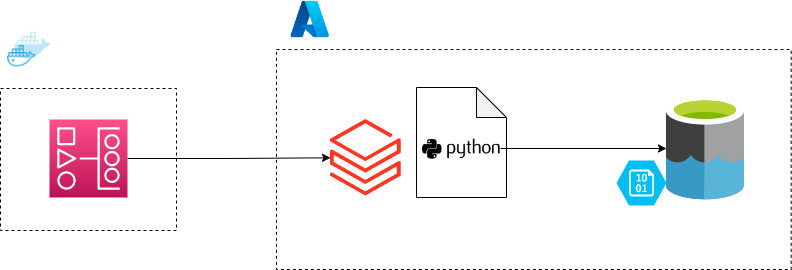

This repository is part of a challange by Raízen applied in selection process for Data Engineer.

First of all this project is a ETL process. We had a three steps:
 1. capture the data
 2. transform the data
 3. load on azure

Ther first step I developed a airflow dag to run a notebook with the transformations on Databricks.

Here is an image to use as an example:

